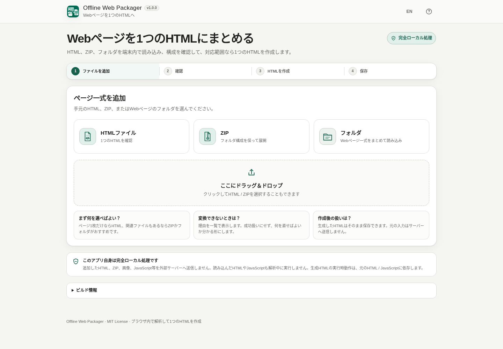

# Offline Web Packager

[](https://github.com/ttomohisa/htmlapps-offline-web-packager/actions/workflows/deploy-pages.yml)
[](LICENSE)
[](https://ttomohisa.github.io/htmlapps-offline-web-packager/)

[English README](README.md)

Offline Web Packager は、保存したWebページを**1つのHTMLにまとめられるか確認し、対応範囲なら実際に単一HTMLを作成する**完全ローカル処理のツールです。

HTMLファイル、ZIP、フォルダを読み込み、必要ファイルの不足、外部サイトへの依存、v1では自動変換しない構成を確認します。対応できないページを壊れたHTMLのまま成功扱いせず、理由を表示します。

## 🚀 Live demo

### [Offline Web PackagerをGitHub Pagesで開く](https://ttomohisa.github.io/htmlapps-offline-web-packager/)

GitHub Pagesから読み込むのは最初のアプリHTMLだけです。追加したHTML、ZIP、画像、JavaScript等はブラウザ内で読み込み・解析し、このアプリからサーバーへアップロードしません。

[](https://ttomohisa.github.io/htmlapps-offline-web-packager/)

## Features

- **HTML / ZIP / フォルダを読み込み** — ボタン選択とDrag & Dropの両方に対応します。
- **作成前に構成を確認** — 必要ファイルの不足、外部リソース、大文字小文字の不一致、実行時に別ファイルを読む構成などを検出します。
- **3種類の分かりやすい判定** — 「1つのHTMLにまとめられます」「確認が必要です」「このままでは1ファイルにできません」を中心に表示します。
- **対応範囲の静的ページを単一HTML化** — ローカルCSS、通常JavaScript、画像、favicon、font、サイズ上限内の静的音声・動画を埋め込みます。
- **実際のWebページで使われるパスに対応** — `../`、ルート相対、CSS `@import`、CSS `url(...)`、`srcset`、query / fragment、URLエンコード、CSSの階層参照を解決します。
- **生成後にも再確認** — 未解決のローカル参照や取り込み漏れが残っていれば通常の保存を許可しません。
- **完全ローカル処理** — 入力ファイルはブラウザメモリで扱い、解析中に入力HTML / JavaScriptを実行せず、アプリ本体は `connect-src 'none'` で実行時通信を遮断します。
- **PC / スマートフォン対応** — 日本語 / 英語、キーボード・フォーカス対応、スマホ下部アクション、進捗表示、キャンセルに対応します。

## Quick start

### Web版を使う

[GitHub Pages版](https://ttomohisa.github.io/htmlapps-offline-web-packager/)を開くだけで使えます。インストールやユーザー登録は不要です。

### 単一HTML版を使う

1. このリポジトリの [`dist/index.html`](https://github.com/ttomohisa/htmlapps-offline-web-packager/blob/main/dist/index.html) をダウンロードします。
2. 現在のブラウザで開きます。
3. HTML、ZIP、またはフォルダを追加します。
4. 判定結果を確認し、対応可能なら単一HTMLを作成して保存します。

一度HTMLをダウンロードすれば、アプリ本体の利用にサーバーは必要ありません。

### ローカルでビルドする

1. このリポジトリをダウンロードまたはcloneします。
2. Windowsで `build-standalone.bat` をダブルクリックします。
3. 生成された `dist/index.html` を開きます。

標準のWindowsビルドにNode.js、Python、ローカルWebサーバーは不要です。

## Usage

1. HTMLファイル、ZIP、またはフォルダを追加します。Drag & Dropも利用できます。
2. HTMLが複数ある場合は、自動検出された「開始HTML」を確認し、必要なら変更します。
3. 解析結果を確認します。
4. **「1つのHTMLにまとめられます」** の場合は **「1つのHTMLを作成」** を押します。
5. 生成HTMLをもう一度確認し、未解決のローカル参照や取り込み漏れがないか検証します。
6. **「HTMLを保存」** で端末へ保存します。

### 判定結果

| 判定 | 意味 |
| --- | --- |
| **1つのHTMLにまとめられます** | 必要なローカルファイルが揃っていて、v1の対応範囲だけで構成されています。 |
| **確認が必要です** | 利用できる可能性はありますが、大文字小文字の不一致や通常の外部リンクなど、確認した方がよい項目があります。 |
| **このままでは1ファイルにできません** | 必要ファイルがない、またはv1で自動変換しない構成を使用しています。 |

ESM、Worker、CSPなどの技術用語は、可能な限り「技術的な詳細」の中へ分離し、一般画面では普通の言葉で理由を表示します。

### v1で単一HTMLへ取り込めるもの

- HTML
- 外部ローカルCSS
- 通常のローカルJavaScript
- CSS `@import`
- CSS `url(...)`
- HTML `srcset`
- PNG / JPEG / GIF / WebP / SVG等の画像
- WOFF / WOFF2等のフォント
- favicon
- サイズ上限内の静的音声・動画

### 検出するが、v1では自動変換しないもの

次の構成は無理に書き換えず、理由を表示します。

- `fetch('./data.json')` などの実行時ファイル読み込み
- ES Modules
- dynamic `import()`
- `import.meta.url`
- Web Worker / SharedWorker
- WASM loader
- Service Worker / PWA
- local iframe
- 複数ページサイトの統合
- React / Vue / Svelteソースのビルド
- npm package resolution
- 外部URLからの自動ダウンロード

## 入力上限とZIPの扱い

v1.0.0の初期基準は以下です。

- 1ファイル 50 MBまで
- 入力全体 100 MBまで
- 2,000ファイルまで

ZIPは展開前に内容を確認します。`../` を使ったpath traversal、絶対パス、シンボリックリンク、暗号化エントリ、未対応の圧縮方式、分割ZIP、ZIP64、重複パス、サイズ / CRCの不整合、展開後サイズ超過、極端な圧縮率を拒否します。

ZIPのSTORE / DEFLATEはブラウザ標準APIで処理し、実行時に第三者ZIPライブラリを読み込みません。

## GitHub Pagesで公開する

リポジトリには、standalone HTMLをビルドしてGitHub Pagesへ公開するworkflowが含まれています。

1. GitHubへ `htmlapps-offline-web-packager` としてpushします。
2. **Settings → Pages → Build and deployment → Source** で **GitHub Actions** を選択します。
3. `main` へpushするか、ActionsタブからPages workflowを手動実行します。
4. 成功すると `https://ttomohisa.github.io/htmlapps-offline-web-packager/` で利用できます。

デプロイ前にstandalone生成、外部通信ポリシー、必要ファイル、バージョン情報、回帰テストを確認します。

## 開発・ビルド構成

```text
.
├─ src/
│  ├─ index.template.html            # UIテンプレート
│  └─ offline-web-packager-core.js   # 仮想FS・解析・生成・再検証
├─ tests/
│  ├─ fixtures/                      # 回帰用Webページ
│  ├─ fixture-zips/                  # ZIP回帰入力
│  ├─ browser-smoke.html             # 実ブラウザ / file:// 確認用
│  └─ *.test.cjs                     # 自動回帰テスト
├─ assets/
│  ├─ favicon.svg
│  ├─ screenshot.png
│  └─ screenshot-en.png
├─ build-standalone.bat
├─ build-standalone.ps1
├─ app.config.json
└─ dist/
   ├─ index.html
   └─ index.self-extract.html
```

### 回帰テスト

Node.jsが利用できる場合は次を実行できます。

```bash
node tests/foundation.test.cjs
node tests/analyzer.test.cjs
node tests/packager.test.cjs
node tests/resolver.test.cjs
node tests/verification.test.cjs
node tests/ux.test.cjs
node tests/performance.test.cjs
node tests/cross-browser.test.cjs
node tests/drop-regression.test.cjs
node tests/i18n.test.cjs
```

Windowsのstandaloneビルド自体にNode.jsは不要です。

`dist/` は生成物です。直接編集せず、`src/index.template.html` または `src/offline-web-packager-core.js` を修正して再ビルドしてください。

## Privacy / 実行時通信

Offline Web Packager自身は**完全ローカル処理**です。

- 追加したHTML、ZIP、画像、JavaScript、フォント等を、このアプリから外部サーバーへ送信しません。
- 入力HTML / JavaScriptはデータとして扱い、解析中に実行しません。
- 入力HTMLをiframeで勝手に表示したり、`eval` したり、入力側のService Workerを登録したりしません。
- standalone HTMLには `connect-src 'none'` を含むCSPを設定しています。
- 入力ファイル本体は `localStorage` へ保存せず、ブラウザメモリで保持します。

GitHub Pages版では最初のアプリHTMLを取得するための通信だけが必要です。ネット接続なしで使う場合は、ダウンロードした `dist/index.html` を直接開いてください。

**生成したHTMLと、このアプリ自身の通信は別です。** 生成HTMLを開いた後の動作は、元のHTML / JavaScriptに依存します。また、このツールはマルウェアスキャナーではなく、入力HTMLや生成HTMLを「安全」と保証するものではありません。

## Browser support

現在のChrome、Edge、Firefox、Safariを主な対象とし、ブラウザ依存機能は実行前に対応可否を確認します。

- フォルダ入力は `webkitdirectory` で相対パスを保持できる場合に使用します。
- フォルダDrag & Dropは `getAsEntry()` / `webkitGetAsEntry()` の両方を確認します。
- DEFLATE ZIPは `DecompressionStream('deflate-raw')` が利用できる場合に展開します。
- 保存はBlob URLと `download` 属性を確認し、必要に応じて新しいタブで開くフォールバックを使います。

PC / スマートフォンを含む実ブラウザの確認手順と `file://` 回帰は [docs/CROSS_BROWSER_LAB.md](docs/CROSS_BROWSER_LAB.md) にまとめています。

## Limitations

- v1は対応範囲の静的ページをまとめるツールであり、汎用JavaScript Bundlerやフレームワークのビルド環境ではありません。
- `fetch`、XMLHttpRequest、Modules、Worker、WASM loader、Service Worker等の実行時依存は検出しますが、自動で書き換えません。
- 複数ページサイトを1アプリへ統合しません。
- 外部URLのリソースを自動ダウンロードしません。
- 静的解析だけで任意のHTML / JavaScriptの安全性を保証することはできません。
- JavaScriptが動的にURLを組み立てる場合など、静的解析だけでは断定できない構成があります。検出できた曖昧な項目は「確認が必要です」として表示します。
- 生成HTMLは、元コードの内容と実行環境によって外部通信を行う可能性があります。
- ブラウザメモリと応答性を守るため、入力サイズとファイル数に上限があります。
- フォルダ入力、フォルダDrag & Drop、ZIP展開、保存の対応状況はブラウザによって異なるため、利用可能な機能を確認して代替手段を案内します。

## Dependencies

Offline Web Packagerは現在、**第三者の実行時ライブラリに依存していません**。

ZIP reader、path resolver、静的解析、単一HTML生成、生成後検証はリポジトリ内で実装し、File API、Blob、`DecompressionStream`、DOM parser等のブラウザ標準機能を利用します。

今後依存ライブラリを追加する場合のnoticeは [THIRD_PARTY_NOTICES.md](THIRD_PARTY_NOTICES.md) に記載します。

## Contributing

不具合報告や機能提案はGitHub Issuesで受け付けます。開発手順は [CONTRIBUTING.md](CONTRIBUTING.md) を参照してください。

## License

Copyright © 2026 ttomohisa

[MIT License](LICENSE) で公開しています。
