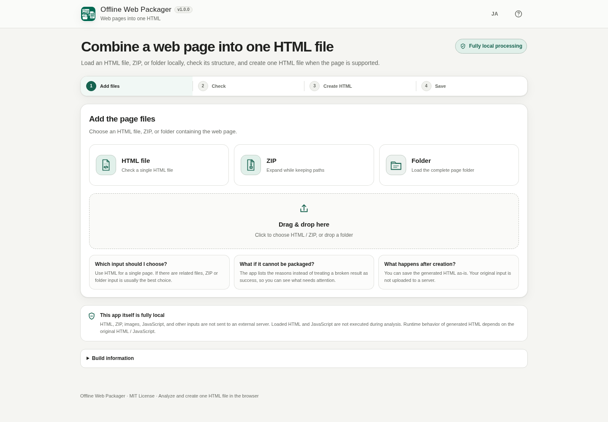

# Offline Web Packager

[](https://github.com/ttomohisa/htmlapps-offline-web-packager/actions/workflows/deploy-pages.yml)
[](LICENSE)
[](https://ttomohisa.github.io/htmlapps-offline-web-packager/)

[日本語版 README](README.ja.md)

A local-only, single-HTML utility for checking whether a saved web page can be combined into one HTML file and, when supported, creating that file without uploading the input to a server.

It accepts an HTML file, ZIP archive, or folder. The app checks local dependencies, missing files, external resources, and structures that v1 does not convert automatically. Unsupported pages are reported with a reason instead of being exported as a broken success.

## 🚀 Live demo

### [Open Offline Web Packager on GitHub Pages](https://ttomohisa.github.io/htmlapps-offline-web-packager/)

GitHub Pages delivers only the initial app HTML. Files you add are read and analyzed locally in the browser and are not uploaded by the app.

[](https://ttomohisa.github.io/htmlapps-offline-web-packager/)

## Features

- **Add HTML, ZIP, or a folder** — Use the file buttons or drag and drop a saved page set.
- **Check before creating anything** — Detect missing local files, external resources, filename case mismatches, and unsupported runtime-loading patterns.
- **Get one of three clear results** — `Can be combined`, `Review needed`, or `Cannot be made into one file as-is`.
- **Package supported static pages** — Embed local CSS, classic JavaScript, images, favicon, fonts, and size-limited static audio/video into one HTML file.
- **Resolve real-world paths** — Handle `../`, root-relative paths, CSS `@import`, CSS `url(...)`, `srcset`, query/fragment suffixes, URL-encoded filenames, and nested CSS references.
- **Verify the generated result** — Re-analyze the output and block normal saving when unresolved local references or missed dependencies remain.
- **Stay local by design** — Input files are kept in browser memory, input HTML/JavaScript is not executed during analysis, and the app runtime uses `connect-src 'none'`.
- **Work on desktop and mobile** — Japanese/English UI, keyboard/focus support, mobile action bar, progress reporting, and cancellation for longer operations.

## Quick start

### Use the web demo

Just [open the demo](https://ttomohisa.github.io/htmlapps-offline-web-packager/). No installation or account is required.

### Use the standalone HTML

1. Download [`dist/index.html`](https://github.com/ttomohisa/htmlapps-offline-web-packager/blob/main/dist/index.html).
2. Open it in a current browser.
3. Add an HTML file, ZIP, or folder.
4. Review the result, create the standalone HTML when available, then save it.

The app itself does not require a server after the HTML has been downloaded.

### Build it locally

1. Download or clone this repository.
2. Double-click `build-standalone.bat` on Windows.
3. Open the generated `dist/index.html`.

The standard Windows build does not require Node.js, Python, or a local web server.

## Usage

1. Add an HTML file, ZIP archive, or folder. You can also drag and drop it onto the input area.
2. If multiple HTML files are present, check the detected start HTML and change it when needed.
3. Review the analysis result.
4. When the result is **Can be combined**, select **Create one HTML file**.
5. The generated HTML is checked again for unresolved local references and missed embedded dependencies.
6. Select **Save HTML** to save the result to your device.

### Result states

| Result | Meaning |
| --- | --- |
| **Can be combined** | Required local files are available and the detected structure is within the v1 packaging scope. |
| **Review needed** | The page may still be usable, but static analysis found something that should be checked, such as a filename case mismatch or ordinary external link. |
| **Cannot be made into one file as-is** | A required local file is missing or the page uses a structure that v1 intentionally does not package automatically. |

Technical terms such as ESM, Worker, or CSP are kept under expandable details where possible. The main result text uses plain-language explanations.

### What v1 can package

Supported local resources include:

- HTML
- External local CSS
- Classic local JavaScript
- CSS `@import`
- CSS `url(...)`
- HTML `srcset`
- PNG / JPEG / GIF / WebP / SVG and similar images
- WOFF / WOFF2 fonts
- favicon
- Size-limited static audio/video

### What v1 detects but does not automatically package

The app reports these structures instead of forcing a conversion:

- `fetch('./data.json')` and similar runtime file loading
- ES Modules
- dynamic `import()`
- `import.meta.url`
- Web Worker / SharedWorker
- WASM loader patterns
- Service Worker / PWA
- local iframe
- multi-page site integration
- React / Vue / Svelte source builds
- npm package resolution
- automatic downloading of external URLs

## Input limits and ZIP handling

The default v1 safeguards are:

- 50 MB maximum per input file
- 100 MB maximum total input
- 2,000 files maximum

ZIP archives are inspected before extraction. The reader rejects path traversal, absolute paths, symlinks, encrypted entries, unsupported compression methods, multi-disk archives, ZIP64, duplicate paths, inconsistent size/CRC data, excessive expanded size, and suspicious compression ratios.

ZIP STORE and DEFLATE entries are handled with browser APIs; no third-party ZIP runtime is loaded.

## Publish with GitHub Pages

The repository includes a workflow that builds the standalone HTML and publishes it to GitHub Pages.

1. Push the repository to GitHub as `htmlapps-offline-web-packager`.
2. Open **Settings → Pages → Build and deployment → Source** and select **GitHub Actions**.
3. Push to `main`, or run the Pages workflow manually from the Actions tab.
4. After a successful deployment, the app is available at `https://ttomohisa.github.io/htmlapps-offline-web-packager/`.

The build verifies the standalone artifact, runtime network policy, required files, version information, and regression tests before deployment.

## Development and build layout

```text
.
├─ src/
│  ├─ index.template.html            # Application UI template
│  └─ offline-web-packager-core.js   # Virtual FS, analyzer, packager, verification
├─ tests/
│  ├─ fixtures/                      # Regression page sets
│  ├─ fixture-zips/                  # ZIP regression inputs
│  ├─ browser-smoke.html             # Manual browser/file:// regression lab
│  └─ *.test.cjs                     # Automated regression tests
├─ assets/
│  ├─ favicon.svg
│  ├─ screenshot.png
│  └─ screenshot-en.png
├─ build-standalone.bat
├─ build-standalone.ps1
├─ app.config.json
└─ dist/
   ├─ index.html
   └─ index.self-extract.html
```

### Run regression tests

When Node.js is available:

```bash
node tests/foundation.test.cjs
node tests/analyzer.test.cjs
node tests/packager.test.cjs
node tests/resolver.test.cjs
node tests/verification.test.cjs
node tests/ux.test.cjs
node tests/performance.test.cjs
node tests/cross-browser.test.cjs
node tests/drop-regression.test.cjs
node tests/i18n.test.cjs
```

The Windows standalone build itself does not require Node.js.

Do not edit generated files in `dist/` directly. Edit `src/index.template.html` or `src/offline-web-packager-core.js`, then rebuild.

## Privacy and runtime network protection

Offline Web Packager itself performs fully local processing:

- Added HTML, ZIP, images, JavaScript, fonts, and other input files are not uploaded by the app.
- Input HTML and JavaScript are treated as data and are not executed during analysis.
- The app does not automatically preview the input in an iframe, call `eval`, or register an input Service Worker.
- The standalone app includes a Content Security Policy with `connect-src 'none'`.
- File contents are kept in memory rather than persisted to `localStorage`.

The GitHub Pages version requires the initial app HTML request. For use without a network connection, open the downloaded `dist/index.html` locally.

**Generated HTML is different from the packager itself.** Runtime behavior of the generated file depends on the original HTML / JavaScript. Offline Web Packager is not a malware scanner and does not certify an input or generated page as safe.

## Browser support

The app is designed for current Chrome, Edge, Firefox, and Safari, with capability checks for browser-dependent features.

- Folder input uses `webkitdirectory` when relative paths can be preserved.
- Folder drag and drop checks both `getAsEntry()` and `webkitGetAsEntry()`.
- DEFLATE ZIP extraction uses `DecompressionStream('deflate-raw')` when available.
- Saving uses Blob URLs and the anchor `download` attribute, with a new-tab fallback when appropriate.

See [docs/CROSS_BROWSER_LAB.md](docs/CROSS_BROWSER_LAB.md) for the reproducible desktop/mobile browser test matrix and manual `file://` checks.

## Limitations

- v1 packages supported static page resources; it is not a general JavaScript bundler or framework build system.
- Runtime data loading with `fetch`, XMLHttpRequest, modules, Workers, WASM loaders, Service Workers, and similar patterns is reported rather than automatically rewritten.
- Multi-page sites are not merged into one application.
- External URLs are not downloaded automatically.
- Static analysis cannot prove that arbitrary HTML or JavaScript is safe.
- JavaScript may construct URLs dynamically in ways static analysis cannot fully determine; ambiguous cases are reported for review when detected.
- Generated HTML can still perform network access if the original code does so and the environment permits it.
- Large inputs are limited to protect browser memory and responsiveness.
- Browser support for folder input, folder drag and drop, ZIP decompression, and file saving varies; the app detects available capabilities and provides fallbacks where possible.

## Dependencies

Offline Web Packager currently has **no third-party runtime library dependencies**.

The ZIP reader, path resolver, static analyzer, packager, and post-build verifier are implemented in the repository and use browser platform APIs such as File API, Blob, `DecompressionStream`, and DOM parsing.

See [THIRD_PARTY_NOTICES.md](THIRD_PARTY_NOTICES.md) for notices if dependencies are added in the future.

## Contributing

Bug reports and feature proposals are welcome through GitHub Issues. See [CONTRIBUTING.md](CONTRIBUTING.md) for development guidance.

## License

Copyright © 2026 ttomohisa

Licensed under the [MIT License](LICENSE).
